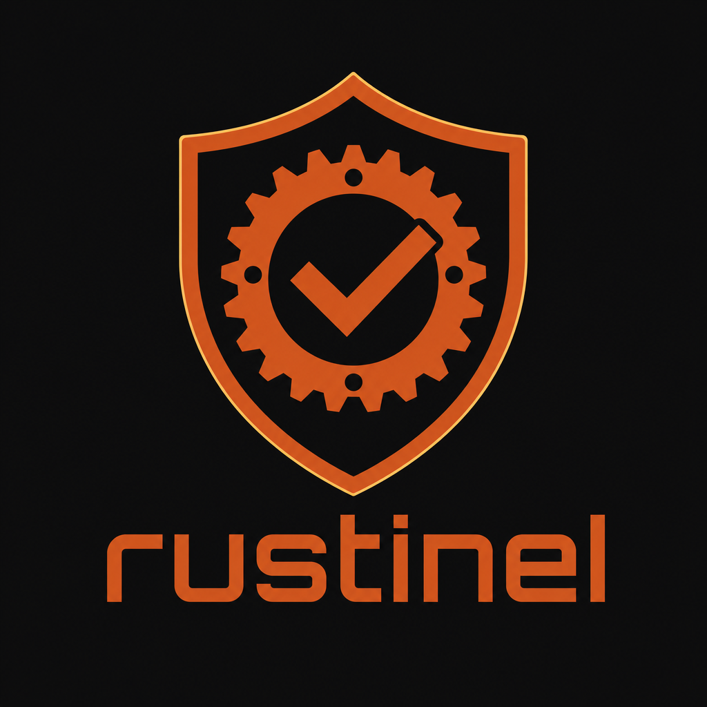
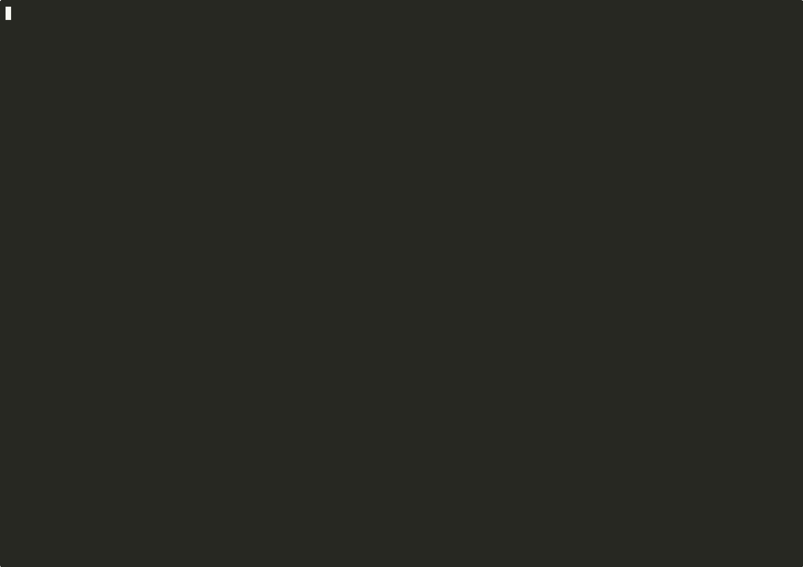

<p align="center">
  
</p>

<h1 align="center">rustinel</h1>

[](https://github.com/kosiorkosa47/rustinel/actions/workflows/ci.yml)
[](https://crates.io/crates/cargo-rustinel)
[](https://docs.rs/rustinel-core)


**Defensive supply-chain risk diff for Rust projects.**
*A pull-request firewall for Cargo dependencies.*

`cargo audit` tells you *whether* you have a vulnerability.
**`rustinel` tells you how a pull request changes your supply-chain risk — and why.**

It catches what advisory scanners miss — **before any CVE exists**: a **new
maintainer** taking over a trusted dependency (the xz / event-stream vector),
**freshly published** versions, **typosquats**, **build scripts that phone home**,
and **dependencies that exfiltrate secrets** — the exact class of the September
2025 `faster_log`/`async_println` crypto-stealers. Static, offline-first, and
emits compliance-grade **SBOM + VEX**.
→ **[What `cargo audit` structurally cannot see](docs/PROACTIVE-DETECTION.md)**

<p align="center">
  
</p>

<p align="center">
  <sub><a href="assets/demo.mp4">▶ watch the full recording (MP4)</a> — a real scan, cross-checked live against <code>cargo audit</code></sub>
</p>

```text
Project risk: 67/100 HIGH
  [█████████████░░░░░░░]
Decision: REVIEW_REQUIRED

Top findings:
  [HIGH] openssl-sys@0.9.99: native FFI dependency detected
        ↳ pulled in via: my-app → reqwest → native-tls → openssl-sys
```

…and the PR comment it posts (see `examples/reports/sample_pr_comment.md`):

```markdown
## rustinel — supply-chain risk

▃ **0 → 24 (+24)** · MEDIUM · Decision: [review] **review required**

`[████░░░░░░░░░░░░░░░░]`  ·  policy: **balanced**  ·  5 packages
```

rustinel performs **static, metadata-only** analysis. It never executes code from
the dependencies it analyzes — see [Security model](#security-model).

**How it compares** to cargo-audit / cargo-deny / cargo-vet / cargo-geiger and
others: see [`docs/COMPARISON.md`](docs/COMPARISON.md). Short version: rustinel
fills the unfilled **PR-centric risk-diff** niche and composes with the rest.

**Proven precise.** A heuristic scanner is only useful if it doesn't cry wolf.
Benchmarked over **966 real crates** (real dependency closures + freshly-published
crates.io uploads): **zero false positives** from the malware-class signals —
while still catching the real attack shapes, and correctly flagging three crates
whose `build.rs` downloads code at build time. Full methodology + a reproducible
script: [`docs/DATA-STUDY.md`](docs/DATA-STUDY.md).

## Install

**MSRV: Rust 1.86** (set by the dependency tree; the network-free `--no-default-features` build needs less).

```bash
# From crates.io — installs the `cargo-rustinel` binary, usable as `cargo rustinel ...`
cargo install cargo-rustinel

# Or a prebuilt binary (no compile), via cargo-binstall:
cargo binstall cargo-rustinel

# Security-minimal build with zero network dependencies (no HTTPS client).
# `--online-metadata` becomes a no-op; everything else is unchanged.
cargo install cargo-rustinel --no-default-features
```

## Usage

```bash
# Analyze one lockfile
cargo rustinel check --lockfile Cargo.lock --format human
cargo rustinel check --lockfile Cargo.lock --format json

# How does this PR change risk?
cargo rustinel diff \
  --base-lockfile base/Cargo.lock \
  --head-lockfile head/Cargo.lock \
  --format markdown

# Splash / version
cargo rustinel demo

# Create a starter policy
cargo rustinel policy init --profile balanced > rustinel.toml

# Sync the RustSec advisory database (git clone/pull into ~/.cargo/advisory-db)
cargo rustinel advisory update
cargo rustinel advisory status

# Export standards-based artifacts (SBOM / vuln interchange)
cargo rustinel export --format cyclonedx --lockfile Cargo.lock   # CycloneDX 1.5 SBOM
cargo rustinel export --format spdx       --lockfile Cargo.lock   # SPDX 2.3 SBOM
cargo rustinel export --format osv        --lockfile Cargo.lock   # OSV records
cargo rustinel export --format openvex    --lockfile Cargo.lock   # OpenVEX document
```

### Formats

| `--format`  | Use |
|-------------|-----|
| `human`     | Terminal summary (default) |
| `json`      | Machine-readable report (see `schemas/rustinel-report.schema.json`) |
| `markdown`  | PR comment (HTML/Markdown-escaped) |
| `sarif`     | SARIF 2.1.0 for code-scanning dashboards |

### Useful flags

- `--policy <file>` — apply a `rustinel.toml` policy (profiles: `strict`, `balanced`, `permissive`).
- `--offline` — never touch the network; use cached advisory data only.
- `--source-path <dir>` — directory of unpacked crate sources for static signals (read-only).
- `--advisory-db <dir>` — a RustSec advisory-db checkout for advisory matching.
- `--online-metadata` — query the crates.io **sparse index** for yanked versions (fixed host, no redirects, validated names — SSRF-safe). Off by default.
- `--no-timestamp` — deterministic, byte-identical output.
- `--fail-on-review-required` — treat `review_required` as a CI failure.

Exit code is driven by **policy only** (not by output format): `fail` → exit 1.

## What it detects

- **Known advisories** — real RustSec advisory-db (v4 `.md` + `.toml`), synced via `advisory update`, matched by semver. Offline-friendly cache.
- **`build.rs`** present (file detected — *never executed*).
- **Suspicious `build.rs` intent** — static scan flagging build scripts that reach the **network** (`reqwest`/`ureq`/`TcpStream`/…) or unpack an **opaque payload** (`include_bytes!`/base64/`libloading`). This is the exact vector used by recent malicious crates; legitimate `cc`-style native builds are *not* flagged.
- **Native / FFI** dependencies (`-sys` naming + manifest `links`).
- **`unsafe`** usage (static count; informational, not a vulnerability by itself).
- **Typosquatting** — dependency names one edit away (Damerau-Levenshtein) from a popular crate (`reqwset`→`reqwest`, `tokoi`→`tokio`), the impersonation vector behind recent malicious crates.
- **Secret-exfil malware fingerprint** — runtime source that scans the project's own `.rs` files **and** reaches the network / handles wallet keys: the exact pattern of the Sept 2025 `faster_log`/`async_println` crypto-stealers (rustinel flags both via this **and** typosquatting).
- **Embedded encoded payload** — source that decodes a large base64/hex blob **and** feeds the result to a process spawn or dynamic library load: a self-contained hidden payload that ships *inside* the crate (no network, so it evades download-based detection). A blob decoded into *data* — a cert, a key, a fixture — is **not** flagged; the execution sink is the discriminator.
- **Multiple versions** of the same crate.
- **License** detection / unknown-license / denied-license policy.
- **Risk delta** between two lockfiles (added / removed / changed packages).

Each finding carries `evidence`, a `confidence` score, and — for transitive
deps — the **dependency path** that pulls it in (`pulled in via: demo → reqwest
→ native-tls → openssl-sys`), so you know *why* a crate is in your tree.

## Risk scoring

Advisories add in full; heuristic signals get **diminishing returns per class**
(so 30 `-sys` crates don't dominate), capped to a 0–100 project score
(`low` 0–19, `medium` 20–49, `high` 50–79, `critical` 80–100). A critical
advisory pins the score to 100. Run with **`--explain`** to see the live
breakdown. Full methodology + signal catalog: [`docs/DESIGN.md`](docs/DESIGN.md).

## Policy

```toml
version = 1
[profile]
name = "balanced"
[risk]
max_project_score = 70
fail_on_delta_above = 35
[advisories]
fail_on = ["critical", "high"]
[licenses]
deny = ["GPL-3.0", "AGPL-3.0"]
```

See `POLICY_SPEC.md` and `examples/policies/` for the full schema and the three
built-in profiles.

## GitHub Action

Posts a **sticky PR comment** with the risk diff (created once, updated in place
on each push), fails the check on a policy violation, and can optionally upload
findings to the repository's **Security tab** as code-scanning alerts:

```yaml
permissions:
  contents: read
  pull-requests: write
  # security-events: write   # only needed for code-scanning: "true"
jobs:
  supply-chain:
    runs-on: ubuntu-latest
    steps:
      - uses: actions/checkout@v4
        with: { fetch-depth: 0 }
      - uses: dtolnay/rust-toolchain@stable
      - run: git show "origin/${{ github.base_ref }}:Cargo.lock" > base.Cargo.lock || cp Cargo.lock base.Cargo.lock
      - uses: kosiorkosa47/rustinel@v0
        with:
          command: diff
          base-lockfile: base.Cargo.lock
          head-lockfile: Cargo.lock
          policy: rustinel.toml
          online-metadata: "true"
          # code-scanning: "true"   # also upload findings to the Security tab
```

See `action.yml` and `examples/github-action.yml`.

## Standards & interchange

`cargo rustinel export` emits compliance-grade artifacts straight from your
lockfile + advisory matches:

| `--format` | Standard | Use |
|------------|----------|-----|
| `cyclonedx` | CycloneDX 1.5 (JSON) | SBOM with embedded vulnerabilities + SHA-256 component hashes — EU CRA / US EO 14028 |
| `spdx`      | SPDX 2.3 (JSON) | SBOM (packages + relationships) |
| `osv`       | osv.dev schema | vulnerability records, interop with OSV tooling |
| `openvex`   | OpenVEX v0.2.0 | machine-readable exploitability statements |

Output is deterministic (use `--no-timestamp`) and JSON-encoded (no injection).

## Security model

> rustinel **never** runs `build.rs`, **never** runs `cargo build` on an
> analyzed project, and **never** loads or executes dependency code.

All analysis is static (source inspection) or metadata-based (lockfiles,
manifests, advisory data). Networking is optional and limited to advisory
metadata; `--offline` disables it and absence of a cached DB is non-fatal.
Untrusted strings are escaped before Markdown/SARIF output. See `SECURITY.md`
for the full threat model and reporting process.

## Workspace layout

```text
crates/rustinel-core/   # analysis library (lockfile, signals, risk, policy, advisory, reporters)
crates/rustinel-cli/    # `cargo-rustinel` binary
action.yml              # GitHub Action (repo root, for Marketplace)
fixtures/               # offline test fixtures
schemas/                # JSON schemas for report & policy
examples/               # policies + sample reports
```

## Development

```bash
cargo fmt --all -- --check
cargo clippy --workspace --all-targets -- -D warnings
cargo test --workspace
```

Tests are fully offline and deterministic. Snapshot tests
(`crates/rustinel-core/tests/snapshots/`) lock the exact reporter output.

## License

Licensed under either of [Apache License, Version 2.0](LICENSE-APACHE) or
[MIT license](LICENSE-MIT) at your option. Unless you explicitly state
otherwise, any contribution intentionally submitted for inclusion in this
crate, as defined in the Apache-2.0 license, shall be dual licensed as above,
without any additional terms or conditions.
